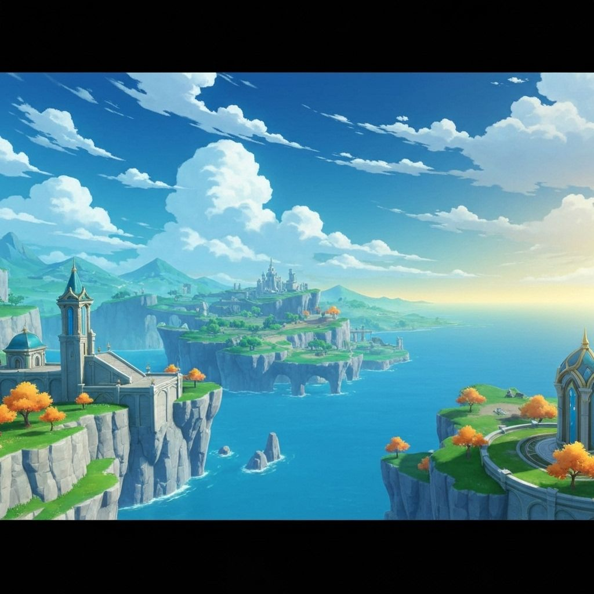

# 🌟 Teyvat Chronicles - Landing Page

<div align="center">
  
  
  <p align="center">
    Landing page moderna e responsiva para a comunidade brasileira de Genshin Impact
  </p>

  
  
  
  
</div>

---

## 📋 Índice

- [Sobre o Projeto](#sobre-o-projeto)
- [Funcionalidades](#funcionalidades)
- [Tecnologias](#tecnologias)
- [Estrutura do Projeto](#estrutura-do-projeto)
- [Pré-requisitos](#pré-requisitos)
- [Instalação](#instalação)
- [Como Executar](#como-executar)
- [Scripts Disponíveis](#scripts-disponíveis)
- [Componentes](#componentes)
- [Estilização](#estilização)
- [Contribuindo](#contribuindo)
- [Licença](#licença)
- [Autores](#autores)
- [Agradecimentos](#agradecimentos)

---

## 🎮 Sobre o Projeto

**Teyvat Chronicles** é uma landing page desenvolvida para a comunidade brasileira de Genshin Impact. O projeto foi criado como parte do curso TADS6 e visa fornecer uma plataforma centralizada para jogadores brasileiros encontrarem guias, builds, notícias e se conectarem com outros membros da comunidade.

### 🎯 Objetivos

- **Centralizar informações** sobre Genshin Impact em português brasileiro
- **Conectar jogadores** através de uma comunidade ativa e engajada
- **Fornecer recursos** como guias de personagens, builds otimizadas e tier lists
- **Promover eventos** e torneios exclusivos da comunidade

---

## ✨ Funcionalidades

### 🏠 Seções Principais

- **Hero Section**: Apresentação impactante com call-to-action
- **Features Section**: Destaque dos principais recursos da comunidade
- **Content Section**: Galeria de conteúdo com guias e artigos
- **Community Section**: Área dedicada à interação da comunidade
- **CTA Section**: Chamadas para ação estratégicas
- **Footer**: Informações de contato e links úteis

### 🎨 Recursos Visuais

- Design moderno e responsivo
- Animações suaves e transições elegantes
- Gradientes e efeitos visuais temáticos
- Suporte a tema claro/escuro (preparado para futura implementação)
- Otimização para diferentes tamanhos de tela

### ⚡ Performance

- Utilização do Turbopack para builds ultra-rápidas
- Otimização de imagens e recursos
- Lazy loading de componentes
- Analytics integrado com Vercel

---

## 🛠️ Tecnologias

### Core

- **[Next.js 15.5.4](https://nextjs.org/)** - Framework React com SSR e SSG
- **[React 19.1.0](https://react.dev/)** - Biblioteca JavaScript para interfaces
- **[TypeScript 5](https://www.typescriptlang.org/)** - Superset JavaScript com tipagem estática

### Estilização

- **[Tailwind CSS 4](https://tailwindcss.com/)** - Framework CSS utility-first
- **[Tailwind Merge](https://github.com/dcastil/tailwind-merge)** - Utilitário para merge de classes
- **[Class Variance Authority](https://cva.style/)** - Gerenciamento de variantes de componentes
- **[tw-animate-css](https://www.npmjs.com/package/tw-animate-css)** - Animações CSS para Tailwind

### UI Components

- **[Radix UI](https://www.radix-ui.com/)** - Componentes acessíveis e não-estilizados
  - Avatar
  - Slot
- **[Lucide React](https://lucide.dev/)** - Biblioteca de ícones moderna

### Utilitários

- **[clsx](https://github.com/lukeed/clsx)** - Utilitário para construção de classNames
- **[next-themes](https://github.com/pacocoursey/next-themes)** - Gerenciamento de temas

### Fontes

- **[Poppins](https://fonts.google.com/specimen/Poppins)** - Fonte principal (sans-serif)
- **[Cinzel](https://fonts.google.com/specimen/Cinzel)** - Fonte decorativa (serif)

### Analytics & Monitoramento

- **[Vercel Analytics](https://vercel.com/analytics)** - Análise de tráfego e performance

### Code Quality

- **[ESLint](https://eslint.org/)** - Linter JavaScript/TypeScript
- **[Rocketseat ESLint Config](https://github.com/Rocketseat/eslint-config-rocketseat)** - Configuração ESLint da Rocketseat
- **[eslint-plugin-simple-import-sort](https://github.com/lydell/eslint-plugin-simple-import-sort)** - Ordenação automática de imports

---

## 📁 Estrutura do Projeto

```
landing-page/
├── public/                                      # Arquivos estáticos
│   ├── anime-character-avatar-gold.jpg
│   ├── anime-character-avatar-red.jpg
│   ├── anime-character-avatar.png
│   ├── genshin-impact-beginner-guide-anime-style.jpg
│   ├── genshin-impact-character-builds-artifacts.jpg
│   ├── genshin-impact-characters-tier-list.jpg
│   ├── genshin-impact-teyvat-landscape-fantasy-world.jpg
│   ├── placeholder-logo.png
│   ├── placeholder-logo.svg
│   ├── placeholder-user.jpg
│   ├── placeholder.jpg
│   └── placeholder.svg
├── src/
│   ├── app/                                     # App Router (Next.js 13+)
│   │   ├── globals.css                          # Estilos globais
│   │   ├── layout.tsx                           # Layout raiz
│   │   └── page.tsx                             # Página inicial
│   ├── components/                              # Componentes React
│   │   ├── ui/                                  # Componentes UI base
│   │   │   ├── avatar.tsx                       # Componente Avatar
│   │   │   ├── button.tsx                       # Componente Button
│   │   │   └── card.tsx                         # Componente Card
│   │   ├── community-section.tsx                # Seção da comunidade
│   │   ├── content-section.tsx                  # Seção de conteúdo
│   │   ├── cta-section.tsx                      # Call-to-action
│   │   ├── features-section.tsx                 # Seção de funcionalidades
│   │   ├── footer.tsx                           # Rodapé
│   │   ├── hero-section.tsx                     # Seção hero
│   │   ├── navigation.tsx                       # Navegação
│   │   └── theme-provider.tsx                   # Provider de tema
│   └── lib/
│       └── utils.ts                             # Funções utilitárias
├── components.json                              # Configuração shadcn/ui
├── eslint.config.mjs                            # Configuração ESLint
├── next-env.d.ts                                # Types do Next.js
├── next.config.ts                               # Configuração Next.js
├── package.json                                 # Dependências
├── postcss.config.mjs                           # Configuração PostCSS
├── tsconfig.json                                # Configuração TypeScript
└── README.md                                    # Este arquivo
```

---

## 📋 Pré-requisitos

Antes de começar, certifique-se de ter instalado:

- **Node.js** >= 20.x
- **npm** ou **yarn** ou **pnpm**
- **Git**

---

## 🚀 Instalação

### 1. Clone o repositório

```bash
git clone <url-do-repositorio>
cd landing-page
```

### 2. Instale as dependências

```bash
npm install
# ou
yarn install
# ou
pnpm install
```

---

## 💻 Como Executar

### Modo de Desenvolvimento

Execute o servidor de desenvolvimento com Turbopack:

```bash
npm run dev
```

Abra [http://localhost:3000](http://localhost:3000) no seu navegador para ver o resultado.

### Build de Produção

```bash
npm run build
npm run start
```

---

## 📜 Scripts Disponíveis

| Script | Descrição |
|--------|-----------|
| `npm run dev` | Inicia servidor de desenvolvimento com Turbopack |
| `npm run build` | Cria build de produção |
| `npm run start` | Inicia servidor de produção |
| `npm run lint` | Executa o linter ESLint |

---

## 🧩 Componentes

### Componentes UI Base (`src/components/ui/`)

- **Avatar**: Exibição de avatares de usuários
- **Button**: Botões customizáveis com variantes
- **Card**: Container para conteúdo com estilo consistente

### Componentes de Seção (`src/components/`)

#### Navigation
Barra de navegação responsiva com links para as seções principais.

#### HeroSection
Seção principal com:
- Título impactante com gradiente
- Descrição da comunidade
- Call-to-action buttons
- Imagem hero em destaque
- Animações de background

#### FeaturesSection
Grid de cards destacando:
- Guias completos
- Builds otimizadas
- Comunidade ativa
- Eventos e torneios

#### ContentSection
Galeria de conteúdo com cards para:
- Guias para iniciantes
- Tier lists de personagens
- Builds e artefatos

#### CommunitySection
Área de engajamento da comunidade com avatares de membros.

#### CTASection
Chamadas para ação finais para conversão de visitantes.

#### Footer
Rodapé com informações e links úteis.

---

## 🎨 Estilização

### Sistema de Design

O projeto utiliza um sistema de design consistente baseado em:

- **CSS Variables** para cores e temas
- **Tailwind CSS** para estilização utility-first
- **shadcn/ui** como base para componentes UI

### Cores Temáticas

```css
/* Variáveis CSS personalizadas */
--primary: /* Cor primária (dourado/amarelo) */
--secondary: /* Cor secundária (azul) */
--accent: /* Cor de destaque (roxo) */
--background: /* Fundo principal */
--foreground: /* Texto principal */
```

### Fontes

- **Poppins**: Corpo do texto (weights: 400, 500, 600, 700, 800)
- **Cinzel**: Títulos e destaques (weights: 400, 600, 700)

---

## 🤝 Contribuindo

Contribuições são bem-vindas! Para contribuir:

1. Fork o projeto
2. Crie uma branch para sua feature (`git checkout -b feature/AmazingFeature`)
3. Commit suas mudanças (`git commit -m 'Add some AmazingFeature'`)
4. Push para a branch (`git push origin feature/AmazingFeature`)
5. Abra um Pull Request

---

## 📝 Licença

Este projeto foi desenvolvido como parte do curso TADS6 para fins educacionais.

---

## 👥 Autores

- **Desenvolvido por**: Luiz Paulo
- **GitHub**: [github.com/luizpaulo](https://github.com/luizpaulo2005)
- **Instituição**: IFMS - Campus Nova Andradina
- **Curso**: Tecnologia em Análise e Desenvolvimento de Sistemas

---

## 🙏 Agradecimentos

- Comunidade Genshin Impact Brasil
- Next.js e Vercel pelo framework incrível
- Radix UI pelos componentes acessíveis
- Tailwind CSS pelo framework CSS poderoso
- Rocketseat pelas boas práticas

---

<div align="center">
  <p>Feito com ❤️ e ☕ para a comunidade Genshin Impact</p>
  <p>⭐ Se você gostou do projeto, dê uma estrela!</p>
</div>
